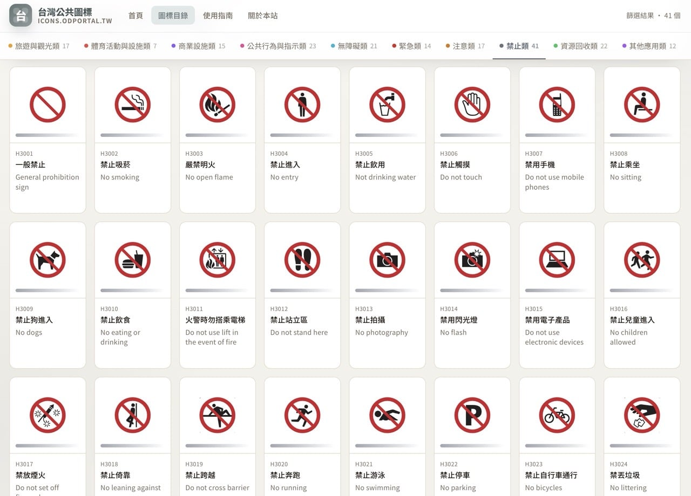

# 台灣公共圖標選型顧問技能

[](https://windsurf.com/)
[](https://claude.ai/)
[](LICENSE)



這是一個 AI 技能，支援 **Windsurf** 與 **Claude
Code**，協助前端工程師、UI/UX 設計師、產品經理、建築師、空間規劃者與導視設計人員，快速找到合適的台灣公共圖標（CNS16282）分類與應用方式。

## 圖標來源

- **官方圖標庫**：https://icons.odportal.tw/
- 由中華民國數位發展部提供的台灣公共圖標
- 符合 CNS16282 國家標準

## 功能特色

使用此技能時，AI 將協助你：

| 功能               | 說明                             |
| ------------------ | -------------------------------- |
| **判斷優先分類**   | 依據你的需求找出最適合的圖標分類 |
| **推薦圖標項目**   | 列出可能需要的具體圖標與代號     |
| **提供搜尋關鍵字** | 給予中英文關鍵字方便查找         |
| **應用位置建議**   | 說明圖標適合放置的位置           |
| **使用方式指引**   | 提醒單獨使用或搭配文字的時機     |
| **場景專屬建議**   | 依數位介面或實體空間提供不同建議 |

## 安裝方式

### 方法一：全域安裝（推薦）

將 skill 複製到 AI IDE 的設定目錄，所有專案皆可使用：

```bash
# macOS
cp -r .claude/skills/taiwan-public-icon-consultant ~/Library/Application\ Support/Claude/skills/
cp .windsurf/skills/taiwan-public-icon-consultant.md ~/Library/Application\ Support/Windsurf/skills/

# Linux
cp -r .claude/skills/taiwan-public-icon-consultant ~/.config/Claude/skills/
cp .windsurf/skills/taiwan-public-icon-consultant.md ~/.config/Windsurf/skills/
```

> Windows 使用者請將檔案複製到 `%APPDATA%\Claude\skills\` 或 `%APPDATA%\Windsurf\skills\`

安裝後執行 `/skills` 確認已載入。

### 方法二：專案內使用

將此專案複製到你的工作區，AI 將自動偵測並載入 skill。

## 使用範例

### 範例 1：醫院導視系統

輸入：「我要設計一個醫院的導視系統」

AI 回應：

```
【需求理解】
為醫院建置一套完整的導視系統，需涵蓋基本設施、無障礙設施與緊急安全標示。

【建議分類】
- 公共設施類（A）：基本設施標示
- 無障礙類（G）：無障礙設施標示
- 緊急類（H）：安全與緊急設施標示

【建議圖標項目】
| 圖標名稱 | 代號 | 適用情境 |
|---------|------|---------|
| 問訊 | F011 | 服務台、櫃檯 |
| 無障礙洗手間 | G011 | 無障礙廁所門牌 |
| 緊急出口 | H011 | 逃生路線標示 |
| 滅火器 | H021 | 消防設備位置 |
| AED | H041 | 自動體外心臟去顫器位置 |

【建議搜尋關鍵字】
中文：問訊櫃台、無障礙設施、緊急出口、滅火器、AED、急救站
英文：information, accessible restroom, emergency exit, fire extinguisher, AED

【應用建議】
標示牌建議尺寸：15cm x 15cm 至 30cm x 30cm
安裝高度：中心點距地 140cm-160cm
材質建議：霧面塑膠板或金屬材質，避免反光

【注意事項】
- 本技能僅提供選型諮詢，圖標著作權屬原權利人所有
- 使用圖標時請遵守官方授權條款並標示來源
```

### 範例 2：App 介面設計

輸入：「做一個捷運查詢 App 需要哪些圖標」

AI 回應：

```
【需求理解】
設計捷運查詢 App，需要交通設施相關圖標。

【建議分類】
- 交通設施類（B）：捷運、公車、轉乘等
- 其他應用類（L）：WiFi、無障礙資訊等

【建議圖標項目】
| 圖標名稱 | 代號 | 適用情境 |
|---------|------|---------|
| 捷運 | B011 | 捷運站點標示 |
| 公車 | B021 | 公車轉乘資訊 |
| 無障礙電梯 | G021 | 無障礙路線規劃 |
| WiFi | L011 | 站內網路服務 |

【應用建議】
UI 圖標尺寸：24px、32px、48px
色彩對比：建議使用高對比配色
點擊區域：最小 44px x 44px
```

## 圖標分類

涵蓋 12 大類台灣公共圖標：

| 分類代號 | 名稱             | 說明                         |
| -------- | ---------------- | ---------------------------- |
| A        | 公共設施類       | 圖書館、郵局、洗手間、電梯等 |
| B        | 交通設施類       | 捷運、公車、停車場、機場等   |
| C        | 旅遊與觀光類     | 遊客中心、景點、露營區等     |
| D        | 體育活動與設施類 | 運動場、游泳池、健身房等     |
| E        | 商業設施類       | 商店、餐廳、加油站等         |
| F        | 公共行為與指示類 | 問訊、排隊、靜音等           |
| G        | 無障礙類         | 無障礙設施、身障專用座位等   |
| H        | 緊急類           | 緊急出口、滅火器、AED 等     |
| I        | 注意類           | 小心地滑、注意台階等         |
| J        | 禁止類           | 禁止吸菸、禁止飲食等         |
| K        | 資源回收類       | 資源回收、廚餘、電池回收等   |
| L        | 其他應用類       | WiFi、充電站、寄物櫃等       |

## 常見圖標速查

| 用途         | 圖標名稱     | 代號 | 官方連結                                      |
| ------------ | ------------ | ---- | --------------------------------------------- |
| 男洗手間     | 男洗手間     | A011 | [查看](https://icons.odportal.tw/icons/A011/) |
| 女洗手間     | 女洗手間     | A012 | [查看](https://icons.odportal.tw/icons/A012/) |
| 無障礙洗手間 | 無障礙洗手間 | G011 | [查看](https://icons.odportal.tw/icons/G011/) |
| 電梯         | 電梯         | A021 | [查看](https://icons.odportal.tw/icons/A021/) |
| 緊急出口     | 緊急出口     | H011 | [查看](https://icons.odportal.tw/icons/H011/) |
| 捷運         | 捷運         | B011 | [查看](https://icons.odportal.tw/icons/B011/) |
| 公車         | 公車         | B021 | [查看](https://icons.odportal.tw/icons/B021/) |
| WiFi         | WiFi         | L011 | [查看](https://icons.odportal.tw/icons/L011/) |

完整圖標清單請見：[https://icons.odportal.tw/](https://icons.odportal.tw/)

## 專案結構

```
taiwan-public-icons-skill/
├── .windsurf/
│   └── skills/
│       └── taiwan-public-icon-consultant.md    # Windsurf skill
├── .claude/
│   └── skills/
│       └── taiwan-public-icon-consultant/
│           └── Skill.md                         # Claude Code skill
├── README.md
├── LICENSE
├── CHANGELOG.md
└── CONTRIBUTING.md
```

## 授權聲明

### Skill 文件授權

此技能文件採用 [MIT License](LICENSE) 授權。

### 圖標授權聲明

- 本技能**不擁有亦不原創** CNS16282 公共圖標
- 圖標著作權屬原權利人（中華民國數位發展部）所有
- 使用圖標時請遵守官方授權條款並標示來源
- 官方圖標庫：[https://icons.odportal.tw/](https://icons.odportal.tw/)

## 貢獻

歡迎提交 Issue 或 Pull Request！

請參閱 [CONTRIBUTING.md](CONTRIBUTING.md) 了解詳細貢獻規範。

## 相關連結

- [官方圖標庫](https://icons.odportal.tw/)
- [數位發展部](https://moda.gov.tw/)
- [CNS16282 標準說明](https://www.bsmi.gov.tw/)

---

Made with ❤️ for Taiwan Public Icons
